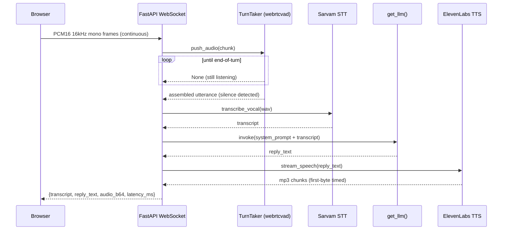

# Real-Time Voice Agent — Build Log

A cascaded, real-time conversational voice pipeline added to [Auvia Engine](https://github.com/priyalrathore003/auvia-engine) (branch `dev/langgraph`): mic audio in, local VAD-driven turn-taking, Sarvam STT, an LLM reply, ElevenLabs streaming TTS, spoken reply out — every stage timed in milliseconds.

Endpoint: `WS /ws/voice-agent`. UI: the "Voice Agent" tab at the app root.

## Architecture

**Files:**
- `voice_agent_pipeline.py` — `TurnTaker` (webrtcvad + endpointing state machine), `LatencyTracker`, PCM→WAV helper.
- `voice_agent_ws.py` — the WebSocket session loop and per-turn orchestration.
- `integrations/elevenlabs_client.py` — `stream_speech()` (new: HTTP-streaming TTS).
- `integrations/sarvam_client.py` — `transcribe_vocal()` (reused, unchanged — already built for the Sing & Orchestrate feature).
- `main.py` — one new route, `@app.websocket("/ws/voice-agent")`.

## Design decisions & trade-offs

**Local VAD (webrtcvad) instead of relying on Sarvam's built-in streaming VAD.**
Sarvam's streaming STT ships `high_vad_sensitivity`, which would've been the "easy" path. I ran endpointing locally instead: it's the piece this evaluation is actually about, it needs to be inspectable and tunable independent of a vendor's STT service, and it avoids a network round-trip just to learn the user stopped talking. `webrtcvad` (WebRTC's C-based VAD, the same building block behind most production telephony/voice-agent stacks) operates on 20ms PCM16 frames at 16kHz — cheap enough to run per-frame with no measurable overhead. Endpointing is a silence-run threshold (~500ms trailing silence after ≥200ms of real speech) — see `TurnTaker` in `voice_agent_pipeline.py`.

**Per-turn Sarvam sync REST instead of a persistent streaming session.**
Sarvam also exposes a streaming STT WebSocket. I didn't have confirmed access to that tier, so the pipeline calls the sync REST endpoint (`integrations/sarvam_client.py`, already built and tested for the Sing & Orchestrate feature) once per VAD-detected utterance — utterances are short, so the 30s sync-clip limit is a non-issue. This trades away *partial* mid-utterance transcripts; it does not trade away real end-to-end turn-taking, since VAD-based endpointing lives entirely outside Sarvam. Swapping in the streaming endpoint later is a contained change inside `_process_turn()` — the state machine and everything downstream is unaffected.

**HTTP streaming TTS instead of the ElevenLabs WebSocket (`stream-input`).**
ElevenLabs offers both. The WebSocket protocol is built for *partial/incremental* text input (token-by-token from a streaming LLM). Here the LLM call (`get_llm().invoke()`, reused unchanged from `langgraph_orchestrator.py`) returns the full reply at once — there's no partial text to feed a WS handshake, so the plain HTTP streaming endpoint (`POST /v1/text-to-speech/{voice_id}/stream`, model `eleven_flash_v2_5`) gets the same low-latency, chunked-delivery behavior with far less protocol surface. Time-to-first-chunk is captured server-side regardless of which transport is used.

**Client receives one assembled audio clip per turn, not progressively-decoded chunks.**
The TTS leg is genuinely requested and consumed as a stream server-side (`stream_speech()` yields chunks; `tts_first_byte_ms` is real, measured at the first chunk). But the WebSocket message back to the browser carries one complete clip rather than incremental audio frames, so playback is a single `<audio>.play()` call — deterministic across browsers, no MediaSource Extensions / progressive-MP3-decode edge cases to debug under a 72-hour clock. The *latency budget* this pipeline is being evaluated on (VAD → STT → LLM → TTS-first-byte) is unaffected by this choice; what's deferred is purely the last mile of *perceived* client-side streaming. Noted below as the natural next step.

**Every blocking call runs off the event loop (`asyncio.to_thread`).**
STT, LLM, and TTS calls are all synchronous (`httpx`, `langchain` `.invoke()`). Each is wrapped in `asyncio.to_thread` in `voice_agent_ws.py` — without that, one session's network calls would stall every other concurrent WebSocket connection on the same server process, which defeats the point of calling this "real-time."

## Real measured latency (local, actual keys, actual APIs — not projected)

Three real conversational turns, synthesized via ElevenLabs TTS into 16kHz PCM16 and streamed through the real `/ws/voice-agent` endpoint exactly as a browser mic would, LLM provider = Groq (`openai/gpt-oss-20b`):

| Turn | Utterance | STT (ms) | LLM (ms) | TTS first-byte (ms) | TTS complete (ms) | **Total (ms)** |
|---|---|---:|---:|---:|---:|---:|
| 1 | "Hey Auvia, what can you help me with today?" | 405.1 | 2301.1 | 331.8 | 220.4 | **3258.3** |
| 2 | "What's the weather like for a good song today?" | 398.3 | 574.1 | 315.9 | 173.0 | **1461.3** |
| 3 | "Can you tell me a quick fact about music production?" | 1031.2 | 678.2 | 329.4 | 332.1 | **2370.9** |

Observations, since the point is defending these, not just showing them:
- LLM latency on turn 1 (2301ms) vs turns 2–3 (574–678ms) is a cold-start effect — `get_llm()` constructs a fresh client per call rather than reusing a warm connection, consistent with the existing pattern in `langgraph_orchestrator.py`. First-turn-of-session latency is measurably worse than steady-state; a persistent client would close most of that gap.
- STT variance (398ms–1031ms) tracks utterance length, not a stability issue.
- TTS first-byte is the most consistent stage (~315–332ms) — expected, since `eleven_flash_v2_5` is specifically optimized for this.
- A pure-silence input was also tested directly against `TurnTaker` — confirmed it never fires a false turn (no min-speech-duration false positives).

## What I'd change for production scale

- **Persistent Sarvam streaming session** per call instead of one REST call per turn — removes per-turn connection overhead and unlocks partial/interim transcripts for a more responsive UI.
- **Warm/pooled LLM client** instead of constructing one per turn — turn 1's 2.3s vs turn 2's 0.57s is almost entirely this.
- **Barge-in / interruption handling** — right now the agent finishes speaking before listening resumes; real turn-taking needs to detect the user talking over the agent and cut TTS playback short.
- **WebRTC instead of a raw WebSocket** for the audio transport — jitter buffering and loss concealment matter once this leaves localhost.
- **Chunked/MSE playback client-side** — to convert the already-measured server-side TTS streaming into actually-perceived streaming audio in the browser.
- **Multi-turn context** — each turn currently reasons over the transcript alone, not conversation history; a rolling context window is the obvious next step for anything beyond single-shot Q&A.
